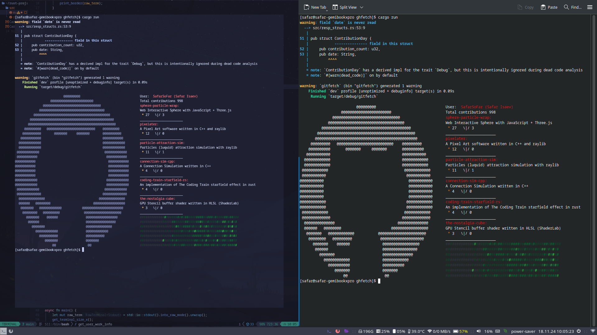

# ghfetch

ghfetch - is an utility to fetch information from GitHub profiles right in terminals.

# Example

# Usage
1. Provide GitHub login as a first argument for user info.
2. Provide GitHub token as a second argument for repo, activity info.
Using GitHub token with only 'read:user, user:follow' is strongly adviced.
3. You can save login and token in the config file when using the utility. 
You will be asked 'Save arguments to the config file?'. Type 'y' to confirm or any other 
key to deny.

# Notes 
The config file is stored in the utility directory. And I do not collect
any data from it. 

# Requirements
For full information fetch you need to provide GitHub token, that is how GitHub API works.

# Known issues 
Rust's 'Termion' crate gives 'Terminal Cursor Time Out' exception when using squeezed Kitty terminal emulator window.

